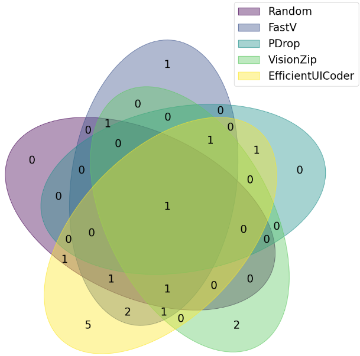
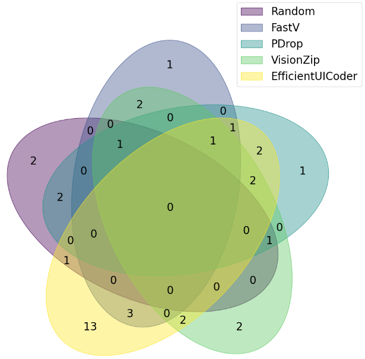
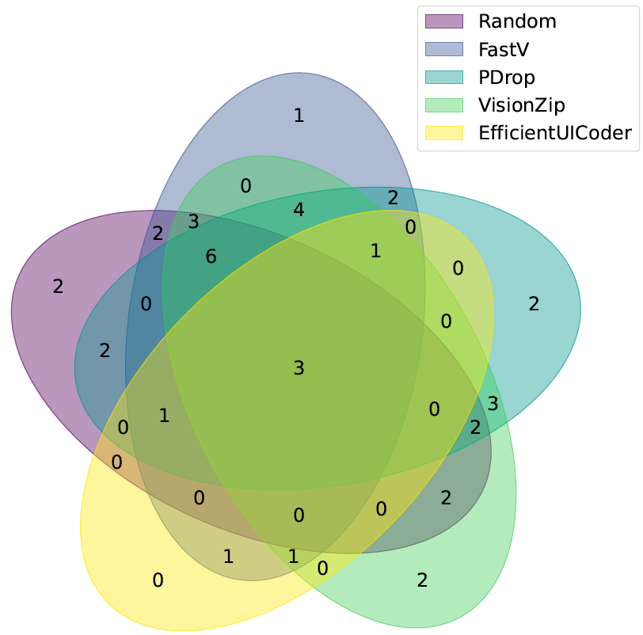

### Overlap Analysis

#### Venn Diagram of Webpages Outperforming Baselines

The figures below present Venn diagrams illustrating how many generated webpages from each method **outperform** the Vanilla on the Design2Code and WebCode2M datasets.

- Venn Diagram of LLava-v1.6-34b on Design2Code dataset

EfficientUICoder produces 5 unique superior webpages, whereas the other baselines produce only 0–2 unique better webpages.

- Venn Diagram of LLava-v1.6-34b on WebCode2M dataset

EfficientUICoder generates 13 unique superior webpages, while the other baselines produce only 1–2 unique better webpages.

#### Venn Diagram of Webpages Underperforming Baselines

The figures below present Venn diagrams illustrating how many generated webpages from each method **underperform** the Vanilla on the Design2Code and WebCode2M datasets.

- Venn Diagram of LLava-v1.6-34b on Design2Code dataset

EfficientUICoder generates 0 unique worse webpages, while the other baselines produce 1–4 unique worse webpages.

- Venn Diagram of LLava-v1.6-34b on WebCode2M dataset

EfficientUICoder generates 0 unique worse webpages, while the other baselines produce 1–2 unique worse webpages.

